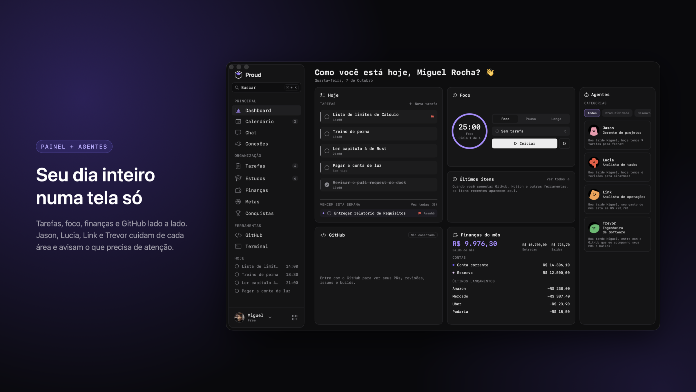
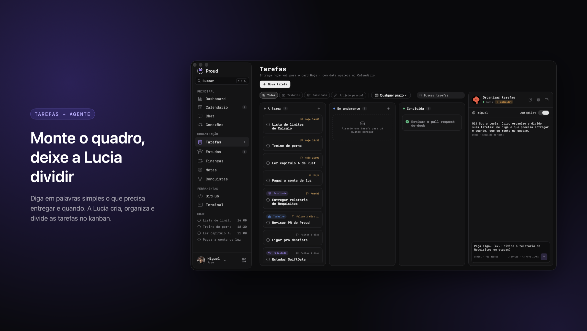

# Proud — Landing Page

Site do **Proud**, o app que traz a Dynamic Island para o Mac para você manter o foco no que está fazendo. Feito em Next.js 14 (App Router) + TypeScript + Tailwind CSS e exportado como site estático.

Powered by [rchlabs](https://rchlabs.vercel.app).

## Screenshots

### Dashboard



### Tarefas



## Páginas

| Rota         | Conteúdo                                                                 |
| ------------ | ------------------------------------------------------------------------ |
| `/`          | Hero com contagem regressiva para o release, mockup interativo do Mac, recursos e agentes de IA |
| `/download`  | Download do DMG e instruções de instalação (macOS 15 Sequoia ou superior) |
| `/changelog` | Notas de versão                                                          |

## Rodar localmente

```bash
npm install
npm run dev
```

Abra http://localhost:3000

## Build de produção

O projeto usa `output: "export"`, então o build gera arquivos estáticos prontos para qualquer hospedagem (Vercel, Netlify, S3, GitHub Pages, etc.):

```bash
npm run build
```

Os arquivos ficam em `out/`. Para pré-visualizar:

```bash
npx serve@latest out
```

## Estrutura

```
app/
  layout.tsx              # layout raiz, metadata e favicon
  page.tsx                # home
  download/page.tsx       # página de download
  changelog/page.tsx      # página de changelog
  globals.css             # estilos base e animações
components/proud/
  ProudHeader.tsx         # logo, versão, "Powered by rchlabs" e navegação
  ProudHero.tsx           # headline, botão de download e contagem regressiva
  ReleaseCountdown.tsx    # contagem regressiva até o release
  ProudShowcase.tsx       # mockup do Mac (menu bar, dock e janela do app)
  DynamicIsland.tsx       # a Dynamic Island do mockup
  ProudFeatures.tsx       # grade de recursos
  ProudCards.tsx          # cards dos agentes de IA
  ProudFooter.tsx         # rodapé com o "Proud" gigante
  Brand.tsx               # nome "Proud" protegido contra tradução automática
  changelog.ts            # conteúdo do changelog
  icons.tsx               # ícones SVG
components/
  RevealObserver.tsx      # animações de entrada ao rolar a página
public/
  proud-logo.png, proud-icon-180.png, proud-favicon-32.png   # marca
  proud-app.jpg, proud-wallpaper.jpg, dock/, agents/          # imagens do mockup
docs/screenshots/         # imagens deste README
```

## Personalizar

- **Data do release:** `RELEASE_AT` em `components/proud/ReleaseCountdown.tsx`
- **Changelog:** `components/proud/changelog.ts`
- **Textos:** direto em cada componente de `components/proud/`
- **Marca:** sempre que escrever "Proud" em texto novo, use `<Brand />` (ou `withBrand()` para strings) para que tradutores como o Google Translate não traduzam o nome
